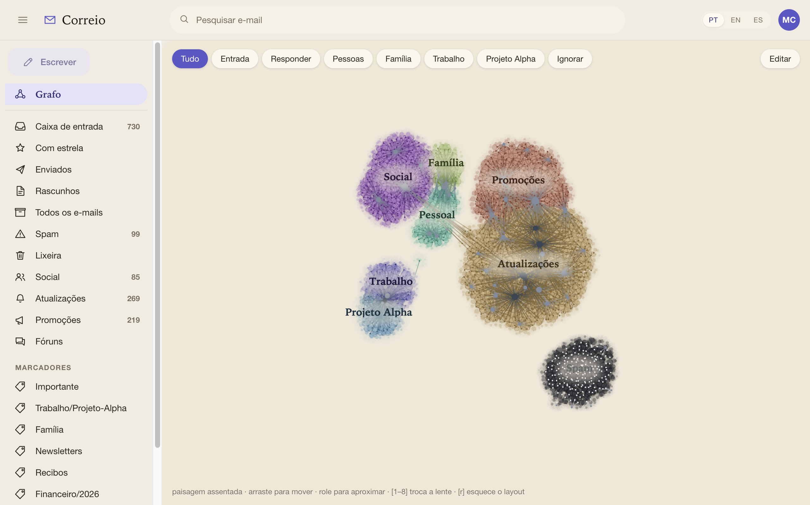

<h1 align="center">Cerrado — Gmail Graph</h1>

  <b>Your mailbox as a landscape, drawn inside Gmail itself.</b> 
  A browser extension that adds one item to Gmail's own navigation rail. Select it and the message
  list is covered by a map of who writes to you and what your mail is made of — read entirely from
  the page Gmail has already drawn.

  

  <a href="#install">Install</a> ·
  <a href="#what-it-does">What it does</a> ·
  <a href="#what-it-reads-and-where-that-goes">Privacy</a> ·
  <a href="#known-limits">Known limits</a> ·
  <a href="https://github.com/entelekheia-ai/gmail-addon/issues">Report something</a>

The same landscape, rendered here by the standalone harness over a <b>generated</b> mailbox —
"Projeto Alpha" and everyone in it are invented. Inside Gmail the picture is the same and the frame
is Gmail's own.

## Why

A mail client answers *what arrived*. It is very good at that and it is the only question it asks.

It cannot show you that four people account for most of a decade of correspondence, or that a folder
you think of as work is three quarters receipts, or that someone you write to constantly has drifted
to once a year. Those are questions about the **shape** of a mailbox, and a list of rows sorted by
date is the wrong instrument for every one of them — not because it is badly designed, but because
sorting by arrival is the opposite of the grouping that would answer them.

So this draws the mailbox instead. Correspondents are nodes, conversations pull them together, and
the regions they settle into are the territories your mail actually has, rather than the folders you
once made.

## Install

Not on the Chrome Web Store. Download the ZIP from
[the latest release](https://github.com/entelekheia-ai/gmail-addon/releases/latest), then:

1. Unzip it somewhere you will not delete — Chrome loads it from that folder every time it starts.
2. Open `chrome://extensions`.
3. Turn on **Developer mode** (top right).
4. **Load unpacked**, and choose the unzipped folder.
5. Open Gmail. A **Grafo** item appears at the top of Gmail's left rail.

Each release's notes carry the ZIP's `sha256`, if you want to check what you downloaded.

## What it does

Select **Grafo** and the canvas covers Gmail's message list. On a mailbox it has never seen, it
starts reading — and it reads by driving Gmail's own list, the way you would: it opens a folder,
reads the page, turns to the next one. **You will see your mailbox navigate itself while this runs.**
That is the scan, not a fault, and the landscape fills in underneath it as it goes.

Afterwards it is instant: what was read lives in your browser, and the map is redrawn from there.

- **The strip along the top** switches lenses — different ways of looking at the same map. *Tudo* is
  the whole picture and the one to come back to.
- **Editar** opens the list of territories and filters. A *territory* is a place on the map, defined
  by a Gmail search query, and mail moves into it. A *filter* has no place: it lights up mail
  wherever it already sits. The pill on each row turns one into the other.
- **Clicking a node** opens that conversation in Gmail.
- **Searching** paints the matches on the map instead of filtering a list.

## What it reads, and where that goes

**What it reads.** The conversation list Gmail has already drawn in your own tab: sender name and
address, subject, snippet, date, labels, and Gmail's own conversation identifiers. It asks Gmail's
API for nothing, has no API key, and signs in to nothing — there is nothing to authorise, because it
only reads the page you are already looking at.

**Where it goes.** Into your browser's own storage for `mail.google.com`, and nowhere else. It is
read back only to redraw the landscape and to resume a scan without repeating it.

**Where it does not go.** The extension makes **no network request of any kind**. Not to us, not to
anyone: it contains no `fetch`, no `XMLHttpRequest`, no analytics and no telemetry, and it does not
use Chrome's own cross-device sync. Mailbox data read by this extension does not leave the browser it
was read in.

It asks for one permission — access to `mail.google.com` — without which its content script never
runs. It does not ask for access to other sites, for your browsing history, for your tabs, for
downloads, or for storage that syncs across your devices.

## Requirements

- **A Chromium browser with WebGPU.** The landscape is drawn on the GPU and there is no fallback: on
  a browser without it, the extension says so rather than showing you something worse.
- Gmail in a browser, signed in. It does not work on the mobile apps.

## Known limits

Worth knowing before the first hour, rather than discovering:

- **The first scan of a large mailbox takes a while and moves you around.** It walks your folders to
  read them. Leave it running; it resumes where it stopped.
- **Measured on one account, one language (pt-BR) and one Gmail layout.** Gmail's markup varies by
  account, language, density and Workspace policy, and the extension reads that markup. Another
  configuration is territory nobody has measured — it may read less, or misread.
- **It notices when Gmail changes underneath it**, and says so in the status line rather than quietly
  drawing a thinner map.

## Report something

The extension has a report button that files an issue
[here](https://github.com/entelekheia-ai/gmail-addon/issues), and what it puts in that issue is
deliberate: **the shape of what it saw, never the content**. Counts, which fields were found and
which were missing — no subject, no sender, no address, no date, no conversation identifier. It
opens the issue form filled in so you can read every word before anything is filed.

That report is the most useful thing you can send about a mailbox that reads wrong, precisely because
it carries nothing private.

## Source and terms

The source is not public. This repository is where the extension is released and where its issues are
filed; the code lives in a private repository.

**No licence has been published yet**, which means no permission to use, copy or redistribute has
been granted in writing. That is an omission being corrected, not a position — if you need the terms
in writing before installing it, open an issue and ask.
